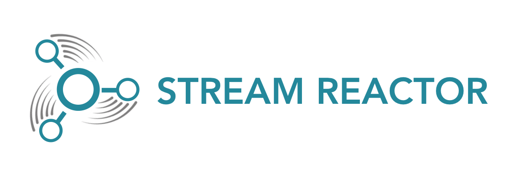

[](https://docs.lenses.io/connectors/)

Join us on slack [](https://launchpass.com/lensesio)

# Lenses for Apache Kafka

Lenses offers SQL (for data browsing and Kafka Streams), Kafka Connect connector management, cluster monitoring and more.

You can find more on [lenses.io](http://www.lenses.io)

# Stream Reactor





A collection of components to build a real time ingestion pipeline.

### Connectors

**Please take a moment and read the documentation and make sure the software prerequisites are met!!**

|Connector       | Type   | Description                                                                                   | Docs |
|----------------|--------|-----------------------------------------------------------------------------------------------|------|
| AzureDocumentDb| Sink   | Kafka connect Azure DocumentDb sink to subscribe to write to the cloud Azure Document Db.     | [Docs](https://docs.lenses.io/connectors/sink/azuredocdb.html)             |
| BlockChain     | Source | Kafka connect Blockchain source to subscribe to Blockchain streams and write to Kafka.        | [Docs](https://docs.lenses.io/connectors/source/blockchain.html)           |
| Bloomberg      | Source | Kafka connect source to subscribe to Bloomberg streams and write to Kafka.                    | [Docs](https://docs.lenses.io/connectors/source/bloomberg.html)            |
| Cassandra      | Source | Kafka connect Cassandra source to read Cassandra and write to Kafka.                          | [Docs](https://docs.lenses.io/connectors/source/cassandra.html)            |
| *Cassandra     | Sink   | Certified DSE Kafka connect Cassandra sink task to write Kafka topic payloads to Cassandra.   | [Docs](https://docs.lenses.io/connectors/sink/cassandra.html)              |
| Coap           | Source | Kafka connect Coap source to read from IoT Coap endpoints using Californium.                  | [Docs](https://docs.lenses.io/connectors/source/coap.html)                 |
| Coap           | Sink   | Kafka connect Coap sink to write kafka topic payload to IoT Coap endpoints using Californium. | [Docs](https://docs.lenses.io/connectors/sink/coap.html)                   |
| Elastic 6      | Sink   | Kafka connect Elastic Search sink to write payloads to Elastic Search 6.x w. tcp or http      | [Docs](https://docs.lenses.io/connectors/sink/elastic6.html)               |
| FTP/HTTP       | Source | Kafka connect FTP and HTTP source to write file data into Kafka topics.                       | [Docs](https://docs.lenses.io/connectors/source/ftp.html)                  |
| Hazelcast      | Sink   | Kafka connect Hazelcast sink to write Kafka topic payloads to Hazelcast.                      | [Docs](https://docs.lenses.io/connectors/sink/hazelcast.html)              |
| HBase          | Sink   | Kafka connect HBase sink to write Kafka topic payloads to HBase.                              | [Docs](https://docs.lenses.io/connectors/sink/hbase.html)                  |
| Hive           | Source | Kafka connect Hive source to read data from Hive/HDFS into Kafka.                             | [Docs](https://docs.lenses.io/connectors/source/hive.html)
| Hive           | Sink   | Kafka connect Hive sink to read data Kafka and load into Hive/HDFS                            | [Docs](https://docs.lenses.io/connectors/sink/hive.html)|
| InfluxDb       | Sink   | Kafka connect InfluxDb sink to write Kafka topic payloads to InfluxDb.
| Kudu           | Sink   | Kafka connect Kudu sink to write Kafka topic payloads to Kudu.                                | [Docs](https://docs.lenses.io/connectors/sink/kudu.html)                   |                        | [Docs](https://docs.lenses.io/connectors/sink/influx.html)                 |
| JMS            | Source | Kafka connect JMS source to write from JMS to Kafka topics.                                   | [Docs](https://docs.lenses.io/connectors/source/jms.html)                  |
| JMS            | Sink   | Kafka connect JMS sink to write Kafka topic payloads to JMS.                                  | [Docs](https://docs.lenses.io/connectors/sink/jms.html)                    |
| MongoDB        | Sink   | Kafka connect MongoDB sink to write Kafka topic payloads to MongoDB.                          | [Docs](https://docs.lenses.io/connectors/sink/mongo.html)                  |
| MQTT           | Source | Kafka connect MQTT source to write data from MQTT to Kafka.                                   | [Docs](https://docs.lenses.io/connectors/source/mqtt.html)                 |
| MQTT           | Sink   | Kafka connect MQTT sink to write data from Kafka to MQTT.                                     | [Docs](https://docs.lenses.io/connectors/sink/mqtt.html)                   |
| Pulsar         | Source | Kafka connect Pulsar source to write data from Pulsar to Kafka.                               | [Docs](https://docs.lenses.io/connectors/source/pulsar.html)                 |
| Pulsar         | Sink   | Kafka connect Pulsar sink to write data from Kafka to Pulsar.                                 | [Docs](https://docs.lenses.io/connectors/sink/pulsar.html)                   |
| Redis          | Sink   | Kafka connect Redis sink to write Kafka topic payloads to Redis.                              | [Docs](https://docs.lenses.io/connectors/sink/redis.html)                  |
| ReThinkDB      | Source | Kafka connect RethinkDb source subscribe to ReThinkDB changefeeds and write to Kafka.         | [Docs](https://docs.lenses.io/connectors/source/rethink.html)              |
| ReThinkDB      | Sink   | Kafka connect RethinkDb sink to write Kafka topic payloads to RethinkDb.                      | [Docs](https://docs.lenses.io/connectors/sink/rethink.html)                |
| VoltDB         | Sink   | Kafka connect Voltdb sink to write Kafka topic payloads to Voltdb.                            | [Docs](https://docs.lenses.io/connectors/sink/voltdb.html)                 |


## Release Notes

**2.0.0**

*   Move to Scala 2.12
*   Move to Kafka 2.4.1 and Confluent 5.4

Deprecated:
    * Druid Sink (not scala 2.12 compatible)
    * Elastic Sink (not scala 2.12 compatible)
    * Elastic5 Sink(not scala 2.12 compatible)

*   Redis
    *   Add support for Redis Streams

*   Cassandra
    *   Add support for setting the LoadBalancer policy on the Cassandra Sink

*   ReThinkDB
    *   Use SSL connection on Rethink initialize tables is ssl set

*   FTP Source
    *   Respect "connect.ftp.max.poll.records" when reading slices

*   MQTT Source
    *   Allow lookup of avro schema files with wildcard subscriptions
  

**1.2.7**

**Features**
*   MQTT Source
    
    Support dynamic topic names in Kafka from a wildcard subscription.
    
    Example: INSERT INTO `$` SELECT * FROM /mqttSourceTopic/+/test
    
    If the MQTT topic is /mqttSourceTopic/A/test this Will result in topics in kafka 
    mqttSourceTopic_A_test
    
*   Cassandra (source)
    *   Support for sending JSON formatted message (with string key) to kafka topic.
    
        Sample KCQL would be like:
        
        `INSERT INTO <topic> SELECT <fields> FROM <column_family> PK <PK_field> WITHFORMAT JSON WITHUNWRAP INCREMENTALMODE=<mode> WITHKEY(<key_field>)`
        
        This would send field's values as JSON object to the said topic.
        
        Note that in kafka connect properties one needs to set `key.converter` and `value.converter` as `org.apache.kafka.connect.storage.StringConverter`
         
    * Added a new INCREMENTALMODE called dsesearchtimestamp that will make a DSE Search queries using Solr instead of a native Cassandra query.

        Instead of the native query:

        SELECT a, b, c, d FROM keyspace.table WHERE pkCol > ? AND pkCol <= ? ALLOW FILTERING;
        We will have now the query with Solr on the dsesearchtimestamp INCREMENTALMODE:

        SELECT a, b, c, d FROM keyspace.table WHERE solr_query=?;
        Where the solr_query will be something like this:

        pkCol:{2020-03-23T15:02:21Z TO 2020-03-23T15:30:12.989Z]
        
*   AzureDocumentDB

    *   Move to version 2.x since 1.x is deprecated in May 2020
        
**Bug fixes**

*   JMS Source

    Allow for tasks parallelization and how the connector tasks parallelization is decided.
    
    Changes:
    *  Allow the connector to respect the `tasks.max` value provided if the user `connect.jms.scale.type`. Available values are `kcql` and `default`.
    If `KCQL` is provided it will be based on the number of KCQL statements written, otherwise it will be driven based on the connector `tasks.max`

*   Kudu Sink
    
    Handle null decimal types correctly
    
*   Mongo Sink

    Handle decimal types

**1.2.4**
**Bug fixes**

*   JMS Source

    Ack the JMS messages was not always possible. Also there was an issue with producing the messages to Kafka out of order from the JMS queue. 
    Changes:
    
    *  Queue messages order are retained when published to Kafka (although they might be routed to different partitions)
    *  Ack happens for each message. This is a change from previous behaviour.
    *  Records which fail to be committed to Kafka are not ack-ed on JMS side

**1.2.3**
**Features**

*   Influx
    *   Support for referencing _key values
    *   Support Unix timestamp as double
*   MQTT
    *   Replicate shared subscription to all tasks
    *   Add sink config to specify retained messages
    *   Add a config to specify retained messages
*   Hazelcast
    *   SSL support
*   MongoDB
    *   SSL support
    *   Removing database name dashes restriction
*   FTP
    *   FTPS support

**Bug fixes**
*   Hive
    *   Fix for writing nested structures to Hive
    *   Improves the code for the async function call to use the CAS

**1.2.2**
**Features**

*   Redis
    *   TTL Support
    *   SSL support
    *   AWS ElasticCache support
    *   GEOADD support
    *   PUB/SUB support
*   MQTT
    *   Multi server connection
    *   Dynamic Target support
*   Hive
    *   Kerberos support
*   Kudu
    *   Comma separated master endpoints

**Bug fixes**

*   Redis
    *   Topic regex
*   JMS
    *   Filters out Kafka records with null value
*   Cassandra
    *   Timestamp comparison
    *   PK check for incremental
*   Mongo
    *   Memory leak

**1.2.1**

*   Fixed Set support on the Cassandra source connector
*   Support Array type in InfluxDB connector
*   Fixed records out of order when insert on the Kudu sink connector
*   Upgrade to kafka 2.1.0
*   Added support for custom delimiter in composite primary keys on the Redis sink connector

**1.2.0**

*   Upgrade to Kafka 2.0
*   New Hive source and sink connector supporting Avro, Parquet and ORC
*   Fix on NPE for Redis multiple sorted sets
*   Fixed setting Mongo primary _id field in upsert mode
*   Fix on handling multiple topics in Redis sort set
*   Fixed mongodb sink exception when PK is compound key
*   Fixed JMS sink with password is not working, wrong context
*   Fixed handling multiple primary keys for sorted sets
*   Fixed Kudu sink autocreate adding unnecessary partition
*   Fixed Avro field with default value does not create table in Kudu
*   Fixed Kudu Connector Can Not AutoCreate Table from Sink Record
*   Fixed JMS sink session rollback exception if session is closed


**1.1.0**

*   Upgrade to Kafka 1.1.0
*   Added SSL, subscription, partitioning, batching and key selection to Pulsar source and sink
*   Elastic6 connector @caiooliveiraeti !
*   HTTP Basic Auth for Elasticsearch http client thanks @justinsoong !
*   Add polling timeout on the JMS source connector to avoid high CPU in the source connector poll thanks #373 @matthedude
*   Fixes on the elastic primary key separator thanks @caiooliveiraeti!
*   Fix on the MQTT class loader
*   Fix on the JMS class loader
*   Fix on JMS to close down connections cleanly #363 thanks @matthedude!
*   Fix on MQTT to correctly handle authentication 
*   Moved MongoDB batch size to KCQL. ``connect.mongodb.batch.size`` is deprecated
*   Added ``connect.mapping.collection.to.json`` to treat maps, list, sets as json when inserting into Cassandra
*   Added support for Elastic Pipelines thanks @caiooliveiraeti!
*   Moved ReThinkDB batch size to KCQL ``connect.rethink.batch.size`` is deprecated
*   MQTT source allows full control of matching the topic ``INSERT INTO targetTopic SELECT * FROM mqttTopic ... WITHREGEX=`$THE_REGEX` ``
*   Upgrade Kudu Client to 0.7
*   Upgrade Azure documentDB client to 1.16.0
*   Upgrade Elastic5 to elastic4s 5.6.5
*   Upgrade Elastic6 to elastic4s 6.2.5
*   Upgrade Hazelcast client to 3.10
*   Upgrade InfluxDB client to 2.9
*   Upgrade MongoDB client to 3.6.3
*   Upgrade Redis client to 2.9
*   Kudu connector now accepts a comma separated list of master addresses
*   Added missing ``connect.elastic.retry.interval`` to elastic5 and elastic6
*   Added a default value set property to Cassandra to allow ``DEFAULT UNSET`` to be added on insert. Omitted columns from maps default to null.
    Alternatively, if set ``UNSET``, pre-existing value  will be preserved
*   Cassandra source batch size now in KCQL. ``connect.cassandra.batch.size`` is deprecated .   


**1.0.0**

* Kafka 1.0.0 Support

**0.4.0**

*   Add FTPS support to FTP connector, new configuration option `ftp.protocol` introduced, either ftp (default) or ftps.
*   Fix for MQTT source High CPU Thanks @masahirom!
*   Improve logging on Kudu
*   DELETE functionality add to the Cassandra sink, deletion now possible for null payloads, thanks @sandonjacobs !
*   Fix in kafka-connect-common to handle primary keys with doc strings thanks, @medvekoma !
*   Fix writing multiple topics to the same table in Cassandra #284
*   Upgrade to Cassandra driver 3.3.0 and refactor Cassandra tests
*   Fix on JMS source transacted queues #285 thanks @matthedude !
*   Fix on Cassandra source, configurable timespan queries. You can now control the timespan the Connector will query for
*   Allow setting initial query timestamp on Cassandra source
*   Allow multiple primary keys on the redis sink

**0.3.0**

*   Upgrade CoAP to 2.0.0-M4
*   Upgrade to Confluent 3.3 and Kafka 0.11.0.0.
*   Added MQTT Sink.
*   Add MQTT wildcard support.
*   Upgrade CoAP to 2.0.0-M4.
*   Added WITHCONVERTERS and WITHTYPE to JMS and MQTT connectors in KCQL to simplify configuration.
*   Added FLUSH MODE to Kudu. Thanks! @patsak

**0.2.6**

### Features

*   Added MQTT Sink
*   Upgrade to Confluent 3.2.2
*   Upgrade to KCQL 2x
*   Add CQL generator to Cassandra source
*   Add KCQL INCREMENTALMODE support to the Cassandra source, bulk mode and the timestamp column type is now take from KCQL
*   Support for setting key and truststore type on Cassandra connectors
*   Added token based paging support for Cassandra source
*   Added default bytes converter to JMS Source
*   Added default connection factory to JMS Source
*   Added support for SharedDurableConsumers to JMS Connectors
*   Upgraded JMS Connector to JMS 2.0
*   Moved to Elastic4s 2.4
*   Added Elastic5s with TCP, TCP+XPACK and HTTP client support
*   Upgrade Azure Documentdb to 1.11.0
*   Added optional progress counter to all connectors, it can be enabled with ``connect.progress.enabled`` which will periodically report log messages processed
*   Added authentication and TLS to ReThink Connectors
*   Added TLS support for ReThinkDB, add batch size option to source for draining the internal queues.
*   Upgrade Kudu Client to 1.4.0
*   Support for dates in Elastic Indexes and custom document types
*   Upgrade Connect CLI to 1.0.2 (Renamed to connect-cli)

### Bug Fixes


*   Fixes for high CPU on CoAP source
*   Fixes for high CPU on Cassandra source
*   Fixed Avro double fields mapping to Kudu columns
*   Fixes on JMS properties converter, Invalid schema when extracting properties

### Misc

*   Refactored Cassandra Tests to use only one embedded instance
*   Removed unused batch size and bucket size options from Kudu, they are taken from KCQL
*   Removed unused batch size option from DocumentDb
*   Rename Azure DocumentDb `connect.documentdb.db` to `connect.documentdb.db`
*   Rename Azure DocumentDb `connect.documentdb.database.create` to `connect.documentdb.db.create`
*   Rename Cassandra Source `connect.cassandra.source.kcql` to `connect.cassandra.kcql`
*   Rename Cassandra Source `connect.cassandra.source.timestamp.type` to `connect.cassandra.timestamp.type`
*   Rename Cassandra Source `connect.cassandra.source.import.poll.interval` to `connect.cassandra.import.poll.interval`
*   Rename Cassandra Source `connect.cassandra.source.error.policy` to `connect.cassandra.error.policy`
*   Rename Cassandra Source `connect.cassandra.source.max.retries` to `connect.cassandra.max.retries`
*   Rename Cassandra Sink `connect.cassandra.source.retry.interval` to `connect.cassandra.retry.interval`
*   Rename Cassandra Sink `connect.cassandra.sink.kcql` to `connect.cassandra.kcql`
*   Rename Cassandra Sink `connect.cassandra.sink.error.policy` to `connect.cassandra.error.policy`
*   Rename Cassandra Sink `connect.cassandra.sink.max.retries` to `connect.cassandra.max.retries`
*   Rename Cassandra Sink Sink `connect.cassandra.sink.retry.interval` to `connect.cassandra.retry.interval`
*   Rename Coap Source `connect.coap.bind.port` to `connect.coap.port`
*   Rename Coap Sink `connect.coap.bind.port` to `connect.coap.port`
*   Rename Coap Source `connect.coap.bind.host` to `connect.coap.host`
*   Rename Coap Sink `connect.coap.bind.host` to `connect.coap.host`
*   Rename MongoDb `connect.mongo.database` to `connect.mongo.db`
*   Rename MongoDb `connect.mongo.sink.batch.size` to `connect.mongo.batch.size`
*   Rename Druid `connect.druid.sink.kcql` to `connect.druid.kcql`
*   Rename Druid `connect.druid.sink.conf.file` to `connect.druid.kcql`
*   Rename Druid `connect.druid.sink.write.timeout` to `connect.druid.write.timeout`
*   Rename Elastic `connect.elastic.sink.kcql` to `connect.elastic.kcql`
*   Rename HBase `connect.hbase.sink.column.family` to `connect.hbase.column.family`
*   Rename HBase `connect.hbase.sink.kcql` to `connect.hbase.kcql`
*   Rename HBase `connect.hbase.sink.error.policy` to `connect.hbase.error.policy`
*   Rename HBase `connect.hbase.sink.max.retries` to `connect.hbase.max.retries`
*   Rename HBase `connect.hbase.sink.retry.interval` to `connect.hbase.retry.interval`
*   Rename Influx `connect.influx.sink.kcql` to `connect.influx.kcql`
*   Rename Influx `connect.influx.connection.user` to `connect.influx.username`
*   Rename Influx `connect.influx.connection.password` to `connect.influx.password`
*   Rename Influx `connect.influx.connection.database` to `connect.influx.db`
*   Rename Influx `connect.influx.connection.url` to `connect.influx.url`
*   Rename Kudu `connect.kudu.sink.kcql` to `connect.kudu.kcql`
*   Rename Kudu `connect.kudu.sink.error.policy` to `connect.kudu.error.policy`
*   Rename Kudu `connect.kudu.sink.retry.interval` to `connect.kudu.retry.interval`
*   Rename Kudu `connect.kudu.sink.max.retries` to `connect.kudu.max.reties`
*   Rename Kudu `connect.kudu.sink.schema.registry.url` to `connect.kudu.schema.registry.url`
*   Rename Redis `connect.redis.connection.password` to `connect.redis.password` 
*   Rename Redis `connect.redis.sink.kcql` to `connect.redis.kcql`
*   Rename Redis `connect.redis.connection.host` to `connect.redis.host`
*   Rename Redis `connect.redis.connection.port` to `connect.redis.port` 
*   Rename ReThink `connect.rethink.source.host` to `connect.rethink.host`
*   Rename ReThink `connect.rethink.source.port` to `connect.rethink.port`
*   Rename ReThink `connect.rethink.source.db` to `connect.rethink.db`
*   Rename ReThink `connect.rethink.source.kcql` to `connect.rethink.kcql`
*   Rename ReThink Sink `connect.rethink.sink.host` to `connect.rethink.host`
*   Rename ReThink Sink `connect.rethink.sink.port` to `connect.rethink.port`
*   Rename ReThink Sink `connect.rethink.sink.db` to `connect.rethink.db`
*   Rename ReThink Sink `connect.rethink.sink.kcql` to `connect.rethink.kcql`
*   Rename JMS `connect.jms.user` to `connect.jms.username`
*   Rename JMS `connect.jms.source.converters` to `connect.jms.converters`
*   Remove JMS `connect.jms.converters` and replace my kcql `withConverters`
*   Remove JMS `connect.jms.queues` and replace my kcql `withType QUEUE`
*   Remove JMS `connect.jms.topics` and replace my kcql `withType TOPIC`
*   Rename Mqtt `connect.mqtt.source.kcql` to `connect.mqtt.kcql`
*   Rename Mqtt `connect.mqtt.user` to `connect.mqtt.username`
*   Rename Mqtt `connect.mqtt.hosts` to `connect.mqtt.connection.hosts`
*   Remove Mqtt `connect.mqtt.converters` and replace my kcql `withConverters`
*   Remove Mqtt `connect.mqtt.queues` and replace my kcql `withType=QUEUE`
*   Remove Mqtt `connect.mqtt.topics` and replace my kcql `withType=TOPIC`
*   Rename Hazelcast `connect.hazelcast.sink.kcql` to `connect.hazelcast.kcql`
*   Rename Hazelcast `connect.hazelcast.sink.group.name` to `connect.hazelcast.group.name`
*   Rename Hazelcast `connect.hazelcast.sink.group.password` to `connect.hazelcast.group.password`
*   Rename Hazelcast `connect.hazelcast.sink.cluster.members` tp `connect.hazelcast.cluster.members`
*   Rename Hazelcast `connect.hazelcast.sink.batch.size` to `connect.hazelcast.batch.size`
*   Rename Hazelcast `connect.hazelcast.sink.error.policy` to `connect.hazelcast.error.policy`
*   Rename Hazelcast `connect.hazelcast.sink.max.retries` to `connect.hazelcast.max.retries`
*   Rename Hazelcast `connect.hazelcast.sink.retry.interval` to `connect.hazelcast.retry.interval`
*   Rename VoltDB `connect.volt.sink.kcql` to `connect.volt.kcql`
*   Rename VoltDB `connect.volt.sink.connection.servers` to `connect.volt.servers`
*   Rename VoltDB `connect.volt.sink.connection.user` to `connect.volt.username`
*   Rename VoltDB `connect.volt.sink.connection.password` to `connect.volt.password`
*   Rename VoltDB `connect.volt.sink.error.policy` to `connect.volt.error.policy`
*   Rename VoltDB `connect.volt.sink.max.retries` to `connect.volt.max.retries`
*   Rename VoltDB `connect.volt.sink.retry.interval` to `connect.volt.retry.interval`


**0.2.5 (8 Apr 2017)**

*   Added Azure DocumentDB Sink Connector
*   Added JMS Source Connector.
*   Added UPSERT to Elastic Search
*   Support Confluent 3.2 and Kafka 0.10.2.
*   Cassandra improvements `withunwrap`
*   Upgrade to Kudu 1.0 and CLI 1.0
*   Add ingest_time to CoAP Source
*   InfluxDB bug fixes for tags and field selection.
*   Added Schemaless Json and Json with schema support to JMS Sink.
*   Support for Cassandra data type of ``timestamp`` in the Cassandra Source for timestamp tracking.

**0.2.4** (26 Jan 2017)

*   Added FTP and HTTP Source.
*   Added InfluxDB tag support. KCQL: INSERT INTO targetdimension ``SELECT * FROM influx-topic WITHTIMESTAMP sys_time() WITHTAG(field1, CONSTANT_KEY1=CONSTANT_VALUE1, field2,CONSTANT_KEY2=CONSTANT_VALUE1)``
*   Added InfluxDb consistency level. Default is ``ALL``. Use ``connect.influx.consistency.level`` to set it to ONE/QUORUM/ALL/ANY
*   InfluxDb ``connect.influx.sink.route.query`` was renamed to ``connect.influx.sink.kcql``
*   Added support for multiple contact points in Cassandra

**0.2.3** (5 Jan 2017)

*   Added CoAP Source and Sink.
*   Added MongoDB Sink.
*   Added MQTT Source.
*   Hazelcast support for ring buffers.
*   Redis support for Sorted Sets.
*   Added start scripts.
*   Added Kafka Connect and Schema Registry CLI.
*   Kafka Connect CLI now supports pause/restart/resume; checking connectors on the classpath and validating configuration of connectors.
*   Support for ``Struct``, ``Schema.STRING`` and ``Json`` with schema in the Cassandra, ReThinkDB, InfluxDB and MongoDB sinks.
*   Rename ``export.query.route`` to ``sink.kcql``.
*   Rename ``import.query.route`` to ``source.kcql``.
*   Upgrade to KCQL 0.9.5 - Add support for `STOREAS` so specify target sink types, e.g. Redis Sorted Sets, Hazelcast map, queues, ringbuffers.

### Building

***Requires gradle 6.0 to build.***

To build

```bash
gradle compile
```

To test

```bash
gradle test
```

To create a fat jar

```bash
gradle shadowJar
```

You can also use the gradle wrapper

```
./gradlew shadowJar
```

To view dependency trees

```
gradle dependencies # or
gradle :kafka-connect-cassandra:dependencies
```

To build a particular project

```
gradle :kafka-connect-elastic5:build
```
To create a jar of a particular project:

```
gradle :kafka-connect-elastic5:shadowJar
```

## Contributing

We'd love to accept your contributions! Please use GitHub pull requests: fork the repo, develop and test your code, 
[semantically commit](http://karma-runner.github.io/1.0/dev/git-commit-msg.html) and submit a pull request. Thanks!
