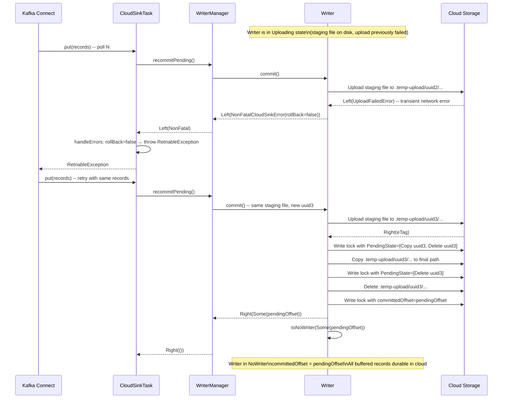
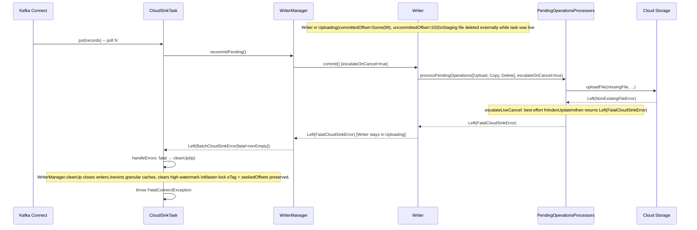
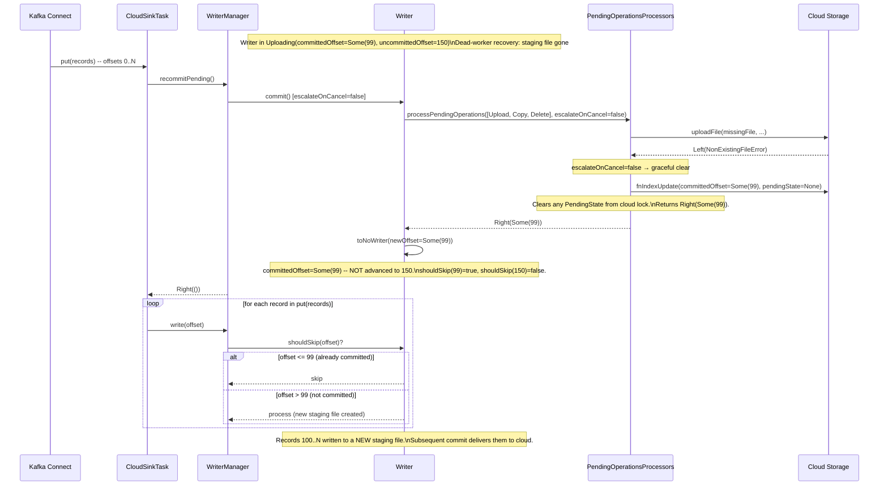

# Datalake Sinks Write Pipeline

This document describes the end-to-end journey of a record through the cloud sink: from `put()` into the Kafka Connect framework, through local staging, cloud upload, and commit, through every error path and its recovery. It covers both indexing-on (the default, exactly-once) and indexing-off modes.

It applies uniformly to all three datalake sink connectors: Amazon S3 (`S3SinkTask`), Google Cloud Storage (`GCPStorageSinkTask`), and Azure Data Lake Storage (`DatalakeSinkTask`). All three extend `CloudSinkTask` and share the same `WriterManager` / `IndexManager` machinery in `kafka-connect-cloud-common`; connector-specific code is limited to the storage interface and authentication.

For the **lock file layout**, master-lock semantics, `PARTITIONBY` granular locks, GC, orphan sweep, and zombie-task fencing, see [datalake-exactly-once-partitionby.md](datalake-exactly-once-partitionby.md). That document assumes the reader knows the upload pipeline; this document fills that gap.

---

## Configuration knobs that change the pipeline shape

`<prefix>` is the connector-specific prefix: `s3` for the S3 sink (`connect.s3.*`), `gcpstorage` for the GCS sink (`connect.gcpstorage.*`), and `datalake` for the Azure Data Lake Storage sink (`connect.datalake.*`).

| Property | Default | Effect |
|----------|---------|--------|
| `connect.<prefix>.exactly.once.enable` | `true` | Enables indexing. When `true`, every commit uses a three-phase `Upload → Copy → Delete` chain with eTag-conditional lock file updates and `shouldSkip` deduplication. When `false`, `NoIndexManager` is wired in and a single direct upload is used; at-least-once semantics only. |
| KCQL `PROPERTIES` commit thresholds: `flush.count`, `flush.size`, `flush.interval` (set via `connect.<prefix>.kcql`) | per-KCQL statement | Control when a writer's buffered records are flushed to cloud storage (record count, file size in bytes, and time interval in seconds). |
| `connect.<prefix>.local.tmp.directory` | a fresh `Files.createTempDirectory("<task id>.<uuid>")` under the JVM temp dir | Where local staging files are written before upload. The file is the only durable copy of buffered records between `write()` and a successful cloud upload. |
| `connect.<prefix>.error.policy` | `THROW` | Selects the `ErrorPolicy` (`NOOP`, `THROW`, or `RETRY`). Only `RETRY` converts a `ConnectException` raised from `put()` into a `RetriableException` that Kafka Connect will retry in-process. |
| `connect.<prefix>.max.retries` | `20` | Number of `put()` retries the `RetryErrorPolicy` will perform before giving up and propagating a `ConnectException` (which fails the task and triggers a Connect restart). |
| `connect.<prefix>.retry.interval` | `60000` (60s) | Delay between in-process retries when `error.policy=RETRY`. Wired into `context.timeout(...)` so that the next `put()` is paced by the framework. |

---

## Sink task lifecycle

### `open(partitions)`

Called by Kafka Connect when partitions are assigned to this task instance (on startup and after every rebalance).

1. `IndexManagerV2.open(topicPartitions)` prunes stale state for partitions that are no longer owned (rebalance case), then reads the **master lock file** from cloud storage for each newly assigned partition.
2. For each partition whose master lock has a `committedOffset`, `context.offset(tp, committedOffset)` is called to seek the consumer to that offset. The consumer will deliver from `committedOffset` onward; `shouldSkip` deduplicates the one-record overlap.
3. No granular locks are read at this point -- they are loaded lazily the first time a record for a given partition key arrives.
4. If indexing is off (`NoIndexManager`), `open` returns empty offsets for every partition and no seeking occurs.

### `put(records)`

Called by Kafka Connect on every consumer poll cycle.

**Step 1 -- recommit any pending uploads.** Before processing new records, `WriterManager.recommitPending()` is called. It finds every writer still in `Uploading` state (left there by a previous failed commit) and calls `Writer.commit` on each one. This is how transient upload failures are retried automatically without a task restart.

**Step 2 -- process each record in delivery order.**

For each `SinkRecord`:

1. Route to the correct `Writer` via `WriterManager.write`. The writer is keyed on `(TopicPartition, partitionValues)`. If no writer exists for the key, a new one is created (`createWriter`), which lazily loads the granular lock from storage (indexing-on, PARTITIONBY) or uses defaults (indexing-on, no PARTITIONBY; indexing-off).
2. `shouldSkip(offset)` consults the writer's in-memory committed offset and uncommitted offset. If the offset was already committed (e.g. the one-record overlap after a seek), the record is silently dropped.
3. `Writer.write(messageDetail)` appends the record to the open `FormatWriter`, which writes to the **local staging file**.
4. After every write, `WriterCommitManager.commitFlushableWritersForTopicPartition` checks whether any writer for the same `TopicPartition` has reached its flush threshold (record count, file size, or time interval). If so, **all** writers for that `TopicPartition` are committed together -- this is required for the `globalSafeOffset` computation to be correct (see [datalake-exactly-once-partitionby.md](datalake-exactly-once-partitionby.md)).

**Step 3 -- empty-poll flush.** If the records collection is empty (Kafka returned nothing), `commitFlushableWriters()` still runs to flush any timed-out writers.

If any step raises a `SinkError`, `CloudSinkTask.handleErrors` runs first and applies a three-way classification:

- **`FatalCloudSinkError`** or a **`BatchCloudSinkError` with `fatal.nonEmpty`** → `WriterManager.cleanUp(tp)` is called for each affected partition (closes writers, evicts granular caches, clears high-watermark; preserves master-lock state because the partition is still owned), then a **`FatalConnectException`** is thrown. `FatalConnectException` is a marker class: every `ErrorPolicy` (`RETRY`, `NOOP`, `THROW`) re-throws it directly without wrapping in `RetriableException` and without logging-and-continuing. This guarantees a live-commit fail-fast error always fails the task immediately.
- **`NonFatalCloudSinkError(swallowable=false)`** or a **`BatchCloudSinkError` with `hasUnswallowable`** (and no fatal errors) → no cleanup; `handleErrors` throws a **`RetriableIntegrityException`** (a `FatalConnectException` subclass). This classification is used by integrity-sensitive transient failures — for example, a cloud read-timeout while loading a granular lock — where it is safe to retry the same `put()` but silently advancing past the error would risk data loss or deduplication violations.
- **`NonFatalCloudSinkError(swallowable=true)`** (the default) or a **`BatchCloudSinkError` with only swallowable non-fatals** → no cleanup; `handleErrors` throws a plain **`ConnectException`** wrapping the underlying error.

The `Try { ... }` in `put()` catches the thrown exception, decrements the configured retry budget, and routes it through the active `ErrorPolicy`:
- **`FatalConnectException`** (excluding `RetriableIntegrityException`): all three policies rethrow it unchanged. The task fails and Kafka Connect restarts it.
- **`RetriableIntegrityException`** with `error.policy=RETRY` and remaining retries: `RetryErrorPolicy` wraps it in a `RetriableException`; Kafka Connect retries the same `put(records)` argument after the configured `connect.<prefix>.retry.interval`. On retry budget exhaustion, `RetriableIntegrityException` is rethrown as-is and the task fails.
- **`RetriableIntegrityException`** with `error.policy=NOOP` or `error.policy=THROW`: rethrown as-is (both policies already rethrow any `FatalConnectException` subclass). The task fails immediately — integrity-sensitive errors are never silently swallowed.
- **Plain `ConnectException`** with `error.policy=RETRY` and remaining retries: rethrown as a `RetriableException`; Kafka Connect retries the same `put(records)` argument.
- **Plain `ConnectException`** when the budget is zero or `error.policy=THROW`: propagated unchanged; the task fails and Kafka Connect restarts it.
- **Plain `ConnectException`** with `error.policy=NOOP`: logged at WARN level and swallowed; processing continues with the next `put()`. (Note: only genuinely swallowable non-fatal errors, e.g. a transient upload failure where the staging file is still on disk, reach this path.)

### `preCommit(currentOffsets)`

Called periodically by Kafka Connect to ask which consumer offsets are safe to commit to the consumer group.

`WriterManager.preCommit` computes a `globalSafeOffset` per `TopicPartition`:

- With active (buffered) writers: `globalSafeOffset = min(firstBufferedOffset across all writers)`. Kafka never advances past a record that may not be in cloud storage.
- With no buffered writers (all committed): `globalSafeOffset = max(committedOffset) + 1`.
- A monotonicity high-watermark (`safeOffsetHighWatermarks`) prevents regression if idle writers are evicted between `preCommit` calls.

In PARTITIONBY mode, `preCommit` also writes the master lock (`updateMasterLock`) and schedules GC of obsolete granular locks. In non-PARTITIONBY mode, the master lock is maintained inside `Writer.commit` itself (via `indexManager.update`), so `preCommit` skips the extra cloud write and only updates the local high-watermark.

### `close(partitions)`

Called before a rebalance or before `stop()`.

1. Suspends background GC/sweep threads (best-effort volatile flag).
2. Calls `WriterManager.close()`: each `Writer.close()` is called. A writer in `Writing` state flushes its `FormatWriter` and deletes the local staging file (buffered records are discarded; they will be re-delivered after the rebalance because the consumer offset has not advanced past them). A writer in `Uploading` state also deletes the local staging file (the master lock protects re-delivery, see "Rebalance while in Uploading" below).
3. `seekedOffsets` in `IndexManagerV2` is **not** cleared here. On the normal `close → stop` path, those entries are needed by the final `drainGcQueue` in `IndexManagerV2.close()`. On the `close → open` rebalance path, `IndexManagerV2.open()` prunes them when it processes the new partition set.

### `stop()`

Called when the task is being torn down.

1. `WriterManager.close()` is called defensively (idempotent; no-op if already closed by `close()`).
2. `IndexManagerV2.close()` shuts down the GC and sweep `ScheduledExecutorService` threads and performs a final synchronous `drainGcQueue()`.
3. Metrics are unregistered.

Each teardown step is wrapped in `Try` so a failure in one step does not prevent later steps from running.

---

## Writer state machine

Each `Writer` has a private `writeState` that is one of three cases.

```mermaid
stateDiagram-v2
    [*] --> NoWriter : new Writer(lastSeekedOffset)

    NoWriter --> Writing : write() / toWriting\nopen staging file + FormatWriter
    Writing --> Writing : write()\nappend record to FormatWriter
    Writing --> Uploading : commit() / toUploading\nclose FormatWriter, reset counters\n(committedOffset NOT advanced)

    Uploading --> NoWriter : commit() success / toNoWriter(Some(pendingOffset))\nUpload→Copy→Delete chain done\ncommittedOffset := pendingOffset\ndelete staging file
    Uploading --> Uploading : commit() transient Upload error\n(UploadFailedError → NonFatalCloudSinkError)\nstaging file preserved → recommitPending retries
    Uploading --> Uploading : commit() live-cancel (escalateOnCancel=true)\nNonExistingFileError → FatalCloudSinkError\nWriter STAYS in Uploading; cleanUp(tp)\n→ Writer.close() → task restart
    Uploading --> NoWriter : dead-worker recovery (escalateOnCancel=false)\nNonExistingFileError → graceful clear\nfnIndexUpdate clears PendingState\ntoNoWriter(oldCommittedOffset)

    NoWriter --> [*] : close()\n(idempotent, no-op)
    Writing --> [*] : close()\nclose FormatWriter, delete staging file
    Uploading --> [*] : close()\ndelete staging file\n(re-delivery via master lock)

    note right of Writing
        Holds: FormatWriter, staging File,
        firstBufferedOffset, uncommittedOffset,
        earliest/latest record timestamps
    end note

    note right of Uploading
        Holds: staging File,
        firstBufferedOffset, uncommittedOffset,
        timestamps. No FormatWriter.
    end note

    note left of NoWriter
        Holds: committedOffset
        (last successful commit or
        seeked offset at startup)
    end note
```



| State | Meaning | Holds |
|-------|---------|-------|
| `NoWriter(commitState)` | Idle. No local file open. | `committedOffset` of the last successful commit (or the seeked offset on startup). |
| `Writing(...)` | Accumulating records. Local staging file is open and being written to. | `FormatWriter`, staging `File`, `firstBufferedOffset`, `uncommittedOffset`, timestamps. |
| `Uploading(...)` | Staging file is complete (closed) and awaiting cloud upload. | Staging `File`, `firstBufferedOffset`, `uncommittedOffset`, timestamps. No `FormatWriter`. |

**Transitions:**

- `NoWriter → Writing` (`toWriting`): first `write()` call opens a new staging file and `FormatWriter`.
- `Writing → Uploading` (`toUploading`): called at the start of `Writer.commit`. The `FormatWriter` is closed (the staging file is now a sealed, uploadable blob). `commitState.reset()` zeroes record count and file size but does **not** advance `committedOffset` yet -- the upload has not completed.
- `Uploading → NoWriter` (`toNoWriter(newOffset)`): called at the end of a successful `Writer.commit`. **`newOffset` is the resolved offset returned by `processPendingOperations`** -- it equals `Some(pendingOffset)` when the upload completed, or the old `committedOffset` when the upload was cancelled (missing local file). The staging file is deleted after `toNoWriter` as a hygiene step.

The `newOffset` parameter is central to data-loss prevention: `committedOffset` only advances when data actually reaches cloud storage. See "Cancellation path" below.

---

## The local staging file

The staging file is the **only durable copy** of a writer's buffered records between the first `write()` call and a successful cloud commit. It lives under `connect.<prefix>.local.tmp.directory` (defaulting to the OS temp directory).

Key properties:

- It persists across `recommitPending` retries. If an upload fails transiently (`UploadFailedError → NonFatalCloudSinkError`), the staging file is untouched and the retry on the next `put()` uploads the same bytes.
- It is deleted by `Writer.close()` (in `Writing` or `Uploading` state) during `close()` or `stop()`. The master lock's `committedOffset` protects re-delivery from Kafka.
- It is deleted as a hygiene step after a successful `toNoWriter` transition. If the delete fails (e.g. the directory was externally removed), the cloud commit has already completed and the failure is logged at WARN and swallowed.
- If the staging file is externally deleted (e.g. `tmpDir` wiped) while the writer is in `Uploading`, the next `recommitPending` detects `NonExistingFileError` and follows the **cancellation path** (described below).

---

## Upload pipeline shapes

The shape of the commit depends on whether indexing is enabled.


**Indexing on:** The staging file is never written directly to the final output path. The intermediate `.temp-upload/<uuid>` object acts as a staging area in cloud storage. If the task crashes after Phase 1 completes, the `PendingState` in the lock file lets the next task owner replay Phase 2 and 3 (Copy and Delete) on restart. The eTag on each lock file write acts as a zombie-task fencing token.

**Indexing off:** A single upload writes directly to the final path. There is no `.temp-upload` indirection, no `PendingState`, no lock file, and no `shouldSkip` deduplication. This is an at-least-once configuration: if the task crashes or rebalances during a partial multipart upload, the partial output may be incomplete or missing, and the records will be re-delivered and re-written from scratch. Use indexing-off only when duplicates are acceptable.

---

## Per-record flow inside `put()`

```mermaid
sequenceDiagram
    participant KC as Kafka Connect
    participant CST as CloudSinkTask
    participant WM as WriterManager
    participant WCM as WriterCommitManager
    participant W as Writer
    participant POP as PendingOperationsProcessors
    participant Cloud as Cloud Storage

    KC->>CST: put(records)
    CST->>WM: recommitPending()
    WM->>WCM: commitPending()
    note over WCM: commits all writers in Uploading state
    WCM->>W: commit() (for each Uploading writer)
    W->>POP: processPendingOperations(...)
    POP->>Cloud: Upload / Copy / Delete
    Cloud-->>POP: result
    POP-->>W: Right(newOffset) or Left(error)
    W-->>WCM: Right(()) or Left(SinkError)
    WCM-->>WM: result
    WM-->>CST: Right(()) or Left(SinkError)
    CST->>CST: handleErrors (rollback if Fatal)

    loop for each SinkRecord
        CST->>WM: write(tpo, messageDetail)
        WM->>W: shouldSkip(offset)?
        alt skip
            W-->>WM: skip
        else process
            WM->>W: write(messageDetail)
            W-->>WM: Right(())
            WM->>WCM: commitFlushableWritersForTopicPartition(tp)
            note over WCM: commits ALL writers for tp if any hit flush threshold
            WCM->>W: commit() (for each flushable writer)
            W->>POP: processPendingOperations(...)
            POP->>Cloud: Upload (→ Copy → Delete if indexing on)
            Cloud-->>POP: result
            POP-->>W: Right(newOffset) or Left(error)
            W-->>WCM: result
        end
    end
    CST-->>KC: (returns; Connect may retry on RetriableException)
```

---

## Commit pipeline: `processOperations` match arms

`Writer.commit` delegates all cloud I/O to `processPendingOperations`, which walks the operation chain recursively. The key match arms (in priority order):

### When there are remaining operations after the current one (`Some(furtherOps)`)

| Head operation | Result | `escalateOnCancel` | Action | Writer state |
|----------------|--------|-------------------|--------|--------------|
| Any | `Left(NonExistingFileError)` (via `UploadOperation`) | `true` (live commit) | `escalateLiveCancel`: best-effort `fnIndexUpdate` then returns `Left(FatalCloudSinkError)`. `rollBack() == true` → `cleanUp`. | Writer stays `Uploading` until `cleanUp(tp)` → `Writer.close()`. Task restarts. |
| Any | `Left(NonExistingFileError)` (via `UploadOperation`) | `false` (dead-worker recovery) | Calls `fnIndexUpdate(oldCommittedOffset, None)` to clear `PendingState` from cloud lock. Returns `Right(oldCommittedOffset)`. | `toNoWriter(oldCommittedOffset)` -- offset is NOT advanced. |
| `UploadOperation` | `Left(UploadFailedError)` (transient) | any | Propagates `Left(NonFatal)` as-is. `Writer.commit` returns `Left(NonFatal)`. `rollBack() == false` → no `cleanUp`. | Stays in `Uploading`. Staging file preserved. Retry on next `put()`. |
| Any | `Left(other SinkError)` | any | Escalates to `FatalCloudSinkError`. `rollBack() == true` → `cleanUp`. | Writers closed, staging files deleted, granular caches evicted. |
| Any | `Right(newEtag)` | any | Writes updated lock file (eTag-conditional) with remaining ops. Recurses. | Continues through the chain. |

### When there are no remaining operations (`None` -- last op)

| Result | `escalateOnCancel` | Action | Writer state |
|--------|-------------------|--------|--------------|
| `Left(NonExistingFileError)` | `true` (live commit) | `escalateLiveCancel`: best-effort `fnIndexUpdate`, returns `Left(FatalCloudSinkError)`. `cleanUp` triggered. | Writer stays `Uploading` until `cleanUp`. Task restarts. |
| `Left(NonExistingFileError)` | `false` (dead-worker recovery) | Calls `fnIndexUpdate(oldCommittedOffset, None)`, clears `PendingState`. Returns `Right(oldCommittedOffset)`. | `toNoWriter(oldCommittedOffset)`. |
| `Left(any error)` | any | Propagates the error as-is (`NonFatal` or `Fatal`). | Stays in `Uploading` on `NonFatal`; `cleanUp` on `Fatal`. |
| `Right(_)` | any | Writes lock file with `committedOffset = pendingOffset`, no `PendingState`. Returns `Right(Some(pendingOffset))`. | `toNoWriter(Some(pendingOffset))` -- offset advances. |

---

## Error and recovery matrix

| Phase | Error class | Writer state after | Recovery path | Data-loss outcome |
|-------|-------------|-------------------|---------------|-------------------|
| Upload | `UploadFailedError` → `NonFatalCloudSinkError` (transient) | `Uploading` (preserved) | `recommitPending` on next `put()` re-attempts from the still-intact staging file | No data loss |
| Upload (live commit) | `NonExistingFileError` + `escalateOnCancel=true` → `FatalCloudSinkError` → `FatalConnectException` | Writer stays `Uploading` until `cleanUp(tp)` → `close()` | Task fails immediately under all error policies. Connect restarts; `IndexManagerV2.open` reads master lock and seeks consumer back to `committedOffset`. Records re-delivered from Kafka. | No data loss (master lock not advanced) |
| Upload (dead-worker recovery) | `NonExistingFileError` + `escalateOnCancel=false` → graceful clear | `NoWriter(oldCommittedOffset)` | Old committed offset preserved in memory. Records re-delivered from Kafka. | No data loss. Records re-written on re-delivery. |
| Upload | Fatal escalation (other non-`NonFatal` error) | `NoWriter` after `cleanUp` | `cleanUp` evicts caches; task restarts; restart seeks from master lock | No data loss (master lock not advanced) |
| Copy | Any error | Fatal. `cleanUp` runs. Granular lock retains `PendingState=[Copy, Delete]`. | On next `put()` (in-place rollback path, LC-2451) or task restart: `ensureGranularLock` detects `PendingState`, replays Copy and Delete against the still-present `.temp-upload/<uuid>` object | No data loss |
| Delete | `FileDeleteError` → `NonFatal` | `Uploading` (preserved) | `recommitPending` on next `put()` builds a new chain; the un-deleted `.temp-upload/<uuid1>` object is orphaned but the data is at the final path | No data loss. Orphaned `.temp-upload/<uuid>` accumulates and must be reaped by an operator-managed bucket lifecycle policy until a dedicated sweep ships in a follow-up ticket. |
| Staging file deleted externally (rebalance or crash) | N/A -- `toNoWriter` called by `Writer.close()` during `close()` | `NoWriter` (via `close()`, not `toNoWriter`) | Consumer seeks from master lock's `committedOffset + 1`. Records re-delivered from Kafka. | No data loss (master lock floor is preserved) |
| Task crash after commit, before `preCommit` | N/A | N/A (process dies) | Restart reads granular/master lock from cloud; deduplication via `shouldSkip` | No data loss, possible replay (no duplication) |
| `preCommit` master lock write fails | N/A | No offset returned to Kafka Connect | Consumer offset frozen. Granular locks preserved (GC skipped). On crash, replay from stale master offset; granular locks deduplicate. | No data loss, no duplication |
| `RetryErrorPolicy` exhausted | Any persistent error | Task fails | Connect restarts task. `IndexManagerV2.open` reads master lock, seeks consumer. Records re-delivered from Kafka. | No data loss |

---

## `recommitPending` retry loop

`WriterManager.recommitPending()` is the in-process retry mechanism for transient upload failures. It is called at the **start of every `put()`** and runs `Writer.commit` on every writer currently in `Uploading` state.



Each call to `Writer.commit` in `Uploading` state generates a **new** `tempFileUuid`. This means each retry uploads the same staging file bytes under a different temporary cloud path. The previous failed attempt left no cloud-side state (the Upload did not complete, so no `PendingState` was written), so the orphaned uuid path does not exist.

---

## Missing staging file: live-commit fail-fast vs dead-worker recovery

When the local staging file is missing at commit time (OS temp-dir pruned, VM ephemeral disk lost, previous task instance crashed after Upload but before completing the chain), `processPendingOperations` detects a `NonExistingFileError` from the Upload step. The behaviour differs based on the **`escalateOnCancel`** flag, which reflects whether the commit is running in a live task or is replaying a dead worker's pending state.

### Live-commit path (`escalateOnCancel=true`, called from `Writer.commit`)

This is the fail-fast path. A staging file that disappears under a running task cannot be retried in-process (the file is gone); allowing silent cancellation here would leave the task in an inconsistent state.



`FatalConnectException` is a marker `ConnectException` subclass. For the `FatalCloudSinkError` (unrecoverable, e.g. missing staging file) case, every `ErrorPolicy` re-throws it directly:

| `error.policy` | Behaviour |
|----------------|-----------|
| `RETRY` | Rethrows `FatalConnectException` unchanged (NOT a `RetriableException`). Retry budget decremented once (harmless; task is failing). |
| `NOOP` | Rethrows `FatalConnectException` unchanged (does NOT log-and-continue). |
| `THROW` | Rethrows `FatalConnectException` unchanged. |

Note: `RetriableIntegrityException` (also a `FatalConnectException` subclass, used for integrity-sensitive transient failures such as a cloud read-timeout while loading a granular lock) is handled differently by `RETRY`: while retries remain, it is wrapped in `RetriableException` and Kafka Connect re-delivers the same batch in-process. Under `NOOP` and `THROW` it behaves identically to a plain `FatalConnectException` — rethrown as-is, task fails immediately. See the `handleErrors` three-way classification above.

The task fails immediately. Kafka Connect schedules a restart. On restart, `IndexManagerV2.open` reads the master lock and calls `context.offset(tp, committedOffset)` to seek the consumer back to `committedOffset`. Records at offsets 100-150 (the uncommitted batch) are re-delivered from Kafka and re-written with a new staging file.

### Dead-worker recovery path (`escalateOnCancel=false`, called from `IndexManagerV2.open`)

When `IndexManagerV2.open` finds a granular lock with `PendingState` that includes an Upload, it attempts to complete the pending chain with `escalateOnCancel=false`. If the staging file is gone (the previous task instance crashed between Upload completion and the Copy/Delete tail), the missing-file is treated as a graceful cancellation: the lock is cleared and the consumer re-delivers the records.



The invariant enforced by `toNoWriter(newOffset)`:

- The in-memory `committedOffset` only advances to an offset that was **actually written to cloud storage**.
- When the staging file is gone, the upload did not happen. `processPendingOperations` returns the old `committedOffset` (via the graceful-clear arm calling `fnIndexUpdate`). `toNoWriter(Some(oldOffset))` preserves it.
- `shouldSkip(150)` returns `false` because `committedOffset=Some(99) < 150`. Records at offsets 100-150 are re-processed normally on the next `put()`.

The `.orElse(commitState.committedOffset)` in `toNoWriter`'s implementation is a safety net: if any future `IndexManager` implementation returns `Right(None)` when it should echo back an offset, the transition keeps the previous value rather than incorrectly regressing to `None`.

---

## Restart-and-seek safety net

Every recovery path described above is an **in-process** recovery: the writer retries from the staging file, or the records are re-skipped via `shouldSkip`. There is a universal fallback for cases where in-process recovery cannot succeed:

1. Every `put()` that fails throws either `RetriableException` (non-fatal, decrements retry budget) or `ConnectException` (task fails immediately).
2. When the `RetryErrorPolicy` budget is exhausted, `ConnectException` is thrown and the task terminates.
3. Kafka Connect schedules a task restart.
4. On restart, `CloudSinkTask.open()` → `IndexManagerV2.open()` reads the **master lock** from cloud storage.
5. `context.offset(tp, committedOffset)` is called for each partition; the consumer seeks back to `committedOffset`.
6. All records from `committedOffset` onward are re-delivered from Kafka.

Because `committedOffset` in the master lock only advances via `preCommit` → `updateMasterLock`, and `preCommit` only advances when at least one `Writer.commit` has successfully completed and `toNoWriter(newOffset)` has advanced the in-memory committed offset, the seek-back always brings back every record that was not durably written to cloud storage.

---

## In-place rollback after a fatal `put()` error (LC-2451)

When a `FatalCloudSinkError` surfaces from `Writer.commit` (e.g. a mid-chain Copy failure), `CloudSinkTask.handleErrors` calls `WriterManager.cleanUp(tp)`. This closes writers, evicts granular lock caches, and clears the per-partition high-watermark -- but it deliberately preserves the master-lock eTag and `seekedOffsets` in `IndexManagerV2`, because the partition is still owned by this task instance.

Kafka Connect then retries `put()` with the same batch. The granular lock in cloud storage still contains the `PendingState` recording the in-flight `(Copy uuid, Delete uuid)` tail. The next `put()` → `createWriter` → `ensureGranularLock` detects the `PendingState` and resolves it (completes Copy and Delete) before the writer proceeds. No data is lost.

This is the LC-2451 in-place rollback path. See [datalake-exactly-once-partitionby.md -- In-place rollback after a fatal `put()` error](datalake-exactly-once-partitionby.md#in-place-rollback-after-a-fatal-put-error-lc-2451--zd-2451) for the full analysis.

With the transient upload fix, this path is only reached for **mid-chain failures** (Copy or Delete). Transient Upload failures no longer escalate to Fatal.

---

## Data-loss guarantees

Three invariants jointly ensure no record is ever permanently lost.

**I1 -- Cloud durability.** A record at offset N is *durable in cloud storage* if and only if one of:
- Its `Writer.commit` phase chain completed successfully (all of Upload, Copy, Delete ran; lock file written without `PendingState`), OR
- The chain completed through Phase 1 (Upload) and the granular/master lock file records a `PendingState` describing the remaining `(Copy, Delete)` operations. The uploaded bytes exist at `.temp-upload/<uuid>` and will be moved to the final path on the next `ensureGranularLock` or restart.

**I2 -- Kafka recoverability.** A record at offset N is *recoverable from Kafka* if and only if Kafka's committed consumer offset for the partition is at or below N. The consumer group will re-deliver N on the next `open()` call.

**I3 -- No permanent loss.** Every record satisfies at least I1 or I2 at all times.

I3 holds by construction:

1. **I2 before I1.** A record is only removed from I2 (Kafka consumer offset advances past it) when `preCommit` returns a new offset to Kafka Connect. `preCommit` only returns an offset when `globalSafeOffset` has advanced. `globalSafeOffset` only advances when `WriterCommitManager.commitWritersWithFilter` has successfully run `Writer.commit` for the affected `TopicPartition`, which means at least I1 holds for every record up to that offset.

2. **`toNoWriter(newOffset)` enforces I1 ↔ I2 alignment.** `committedOffset` in the `NoWriter` state is the resolved offset returned by `processPendingOperations`. It equals the actual committed offset in the cloud lock file. If the staging file is gone during dead-worker recovery (`escalateOnCancel=false`), `processPendingOperations` returns the *old* `committedOffset` (via the graceful-clear arm) and `toNoWriter` preserves it. If the staging file is gone during a live commit (`escalateOnCancel=true`), a `FatalCloudSinkError` is raised and the task restarts, with the master lock providing the seek-back floor. In neither case does the in-memory state claim an offset is committed until cloud storage confirms it.

3. **`shouldSkip` prevents double-writes.** If a record is replayed by Kafka after a seek-back, `shouldSkip(offset)` checks the writer's `committedOffset`. Only records above the committed offset are written. For PARTITIONBY, granular locks per writer key provide independent dedup floors. See [datalake-exactly-once-partitionby.md](datalake-exactly-once-partitionby.md) for the full dedup proof.

**Indexing-off note.** When `exactly.once.enable=false`, I3 reduces to an at-least-once guarantee: `shouldSkip` always returns `false`, so replayed records are always re-written. The cloud lock file and `PendingState` mechanisms do not exist. The risk of partial output (bytes written to the final path but the task crashes before completing a large multipart upload) is cloud-provider dependent.

---

## NoIndexManager mode (`exactly.once.enable=false`): at-least-once contract on the live fail-fast path

When `connect.<prefix>.exactly.once.enable=false`, `WriterManagerCreator.from` wires in `NoIndexManager` instead of `IndexManagerV2`. The three-phase Upload → Copy → Delete chain collapses to a single direct upload: there are no granular locks, no master locks, no `PendingState`, and no eTag-conditional writes.

**Fail-fast still applies.** Even in `NoIndexManager` mode, a missing staging file during a live commit (`escalateOnCancel=true`) raises a `FatalCloudSinkError` and ultimately a `FatalConnectException`. The at-least-once guarantee is maintained by the combination of:

1. **No offset advance without a successful upload.** `NoIndexManager.update` echoes the committed offset back unconditionally. `toNoWriter(newOffset)` only runs if `processPendingOperations` returns `Right(...)`, which requires the Upload to succeed. A missing staging file returns `Left(FatalCloudSinkError)` and `toNoWriter` is never reached.
2. **Kafka re-delivery.** Because `preCommit` only surfaces an offset after `toNoWriter` has advanced `committedOffset`, and `FatalConnectException` prevents any `preCommit` advancement, the consumer group offset is not advanced past the failing batch. After the task restarts, Kafka re-delivers the records from the last committed consumer-group offset.
3. **No `shouldSkip` deduplication.** In at-least-once mode, `shouldSkip` always returns `false`. Replayed records are always re-written. This is the accepted trade-off for the simpler pipeline.

**What `NoIndexManager.getSeekedOffsetForTopicPartition` returns.** It always returns `None`, so `IndexManagerV2.open`'s seek-back logic is not exercised. Kafka Connect's own consumer-group offset commits (driven by `preCommit`) are the sole recovery floor. This means:

- After a task restart in `NoIndexManager` mode, the consumer seeks to whatever the consumer group last committed (not to a connector-managed master lock).
- If the task crashed before `preCommit` returned a new offset, all records since the previous `preCommit` are re-delivered and re-written to cloud storage.

**Error policy behaviour is identical.** `FatalConnectException` is rethrown by all three error policies (`RETRY`, `NOOP`, `THROW`), exactly as in indexing-on mode. The only difference is that there is no master lock to read on restart, so the seek-back depth is controlled by Kafka's consumer group offset rather than the connector's lock file.

---

## Connectors covered

This pipeline lives in `kafka-connect-cloud-common` and applies uniformly to:

| Connector | Sink Task |
|-----------|-----------|
| Amazon S3 | `S3SinkTask` |
| Google Cloud Storage | `GCPStorageSinkTask` |
| Azure Data Lake Storage | `DatalakeSinkTask` |

All three extend `CloudSinkTask` and use `WriterManagerCreator.from` to select the appropriate `IndexManager` (either `IndexManagerV2` when indexing is enabled, or `NoIndexManager` when disabled).
