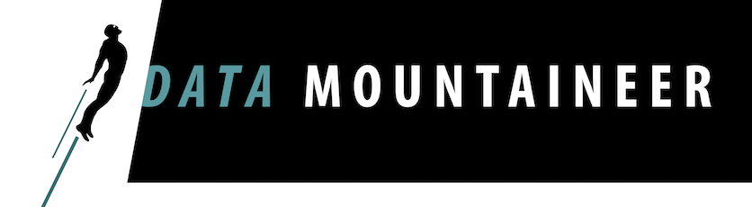

[](http://streamreactor.readthedocs.io/en/latest/redis.html#kafka-connect-redis)


## Kafka Connect Redis

A Connector and Sink to write events from Kafka to Redis. The connector takes the value from the Kafka Connect SinkRecords and inserts a new entry to Redis.

## Prerequisites

* Jedis 2.8.1
* Confluent 3.0.0
* Java 1.8 
* Scala 2.11

##Build

````bash
 gradle compile
 ```
 
 To test
 
 ```bash
 gradle test
 ```
 
 To create a fat jar
 
 ```bash
 gradle fatJar
 ```
 
 or with no tests run
 
 ```
 gradle fatJarNoTest
 ```
 
 You can also use the gradle wrapper
 
 ```
 ./gradlew fatJar
 ```

See the documentation for more information.